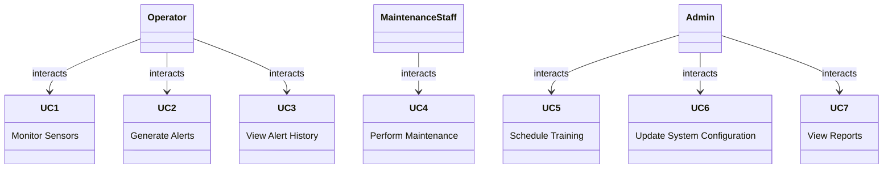

will include the following:
- home
- about
- contact
- projects
- blog
- resume
- socials
- good reads: https://www.youtube.com/watch?v=uiNB-6SuqVA
- tech stack

meta Elements
• Specify information about a document
– Attribute name
• Identifies the type of meta element
• “keywords” ( name = “keywords” )
– Provides search engines with a list of words that describe
a page
• “description” ( name = “description” )
– Provides a description of a site
– Attribute content
• Provides the information search engine use to 
catalog pages
52
5
main.html
(1 of 2)
53
1 <?xml version = "1.0"?> 
2 <!DOCTYPE html PUBLIC "-//W3C//DTD XHTML 1.1//EN" //W3C//DTD XHTML 1.1//EN" //W3C//DTD XHTML 1.1//EN" 
3 "http://www.w3.org/TR/xhtml11/DTD/xhtml11.dtd"> 
4 
5 <!-- Fig. 5.8: main.html Fig. 5.8: main.html Fig. 5.8: main.html ----> 
6 <!-- <meta> tag <meta> tag <meta> tag ----> 
7 
8 <html xmlns = "http://www.w3.org/1999/xhtml" "http://www.w3.org/1999/xhtml"> 
9 <head> <head> 
10 <title>Internet and WWW How to Program - Internet and WWW How to Program - Welcome Welcome Welcome Welcome</title></title> </title> </title> 
11 
12 <! <! <!-- <!-- <meta> tags provide search engines with <meta> tags provide search engines with <meta> tags provide search engines with ----> 
13 <! <! <!-- <!-- information used to catalog a site information used to catalog a site information used to catalog a site ----> 
14 <meta na<meta na <meta name = <meta name = "keywords" content = "Web page, design, "Web page, design, 
15 XHTML, tutorial, personal, help, index, form, XHTML, tutorial, personal, help, index, form, 
16 contact, feedback, list, links, frame, deitel" /> 
17 
18 <meta name = "description" content = "This Web site will "This Web site will 
19 help you learn the basics of XHTML and Web page design 
20 through the use of interactive examples and through the use of interactive examples and 
21 instruction." instruction." /> /> 
22 
23 </head> 


# React + TypeScript + Vite

This template provides a minimal setup to get React working in Vite with HMR and some ESLint rules.

Currently, two official plugins are available:

- [@vitejs/plugin-react](https://github.com/vitejs/vite-plugin-react/blob/main/packages/plugin-react/README.md) uses [Babel](https://babeljs.io/) for Fast Refresh
- [@vitejs/plugin-react-swc](https://github.com/vitejs/vite-plugin-react-swc) uses [SWC](https://swc.rs/) for Fast Refresh

## Expanding the ESLint configuration

If you are developing a production application, we recommend updating the configuration to enable type aware lint rules:

- Configure the top-level `parserOptions` property like this:

```js
export default {
  // other rules...
  parserOptions: {
    ecmaVersion: 'latest',
    sourceType: 'module',
    project: ['./tsconfig.json', './tsconfig.node.json'],
    tsconfigRootDir: __dirname,
  },
}
```

- Replace `plugin:@typescript-eslint/recommended` to `plugin:@typescript-eslint/recommended-type-checked` or `plugin:@typescript-eslint/strict-type-checked`
- Optionally add `plugin:@typescript-eslint/stylistic-type-checked`
- Install [eslint-plugin-react](https://github.com/jsx-eslint/eslint-plugin-react) and add `plugin:react/recommended` & `plugin:react/jsx-runtime` to the `extends` list




```mermaid
%% Use Case Diagram for a Nuclear Leakage Detection System
%% Define the diagram type as 'usecase'

    actor "Operator" as operator
    actor "Admin" as admin
    actor "Maintenance Staff" as maintenance

    usecase "Monitor Sensors" as UC1
    usecase "Generate Alerts" as UC2
    usecase "View Alert History" as UC3
    usecase "Perform Maintenance" as UC4
    usecase "Schedule Training" as UC5
    usecase "Update System Configuration" as UC6
    usecase "View Reports" as UC7

    operator --> UC1
    operator --> UC2
    operator --> UC3
    maintenance --> UC4
    admin --> UC5
    admin --> UC6
    admin --> UC7
```